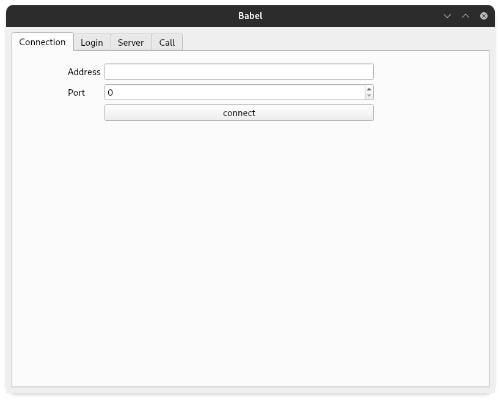
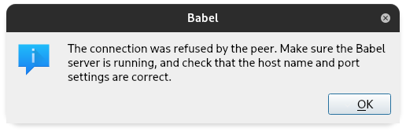
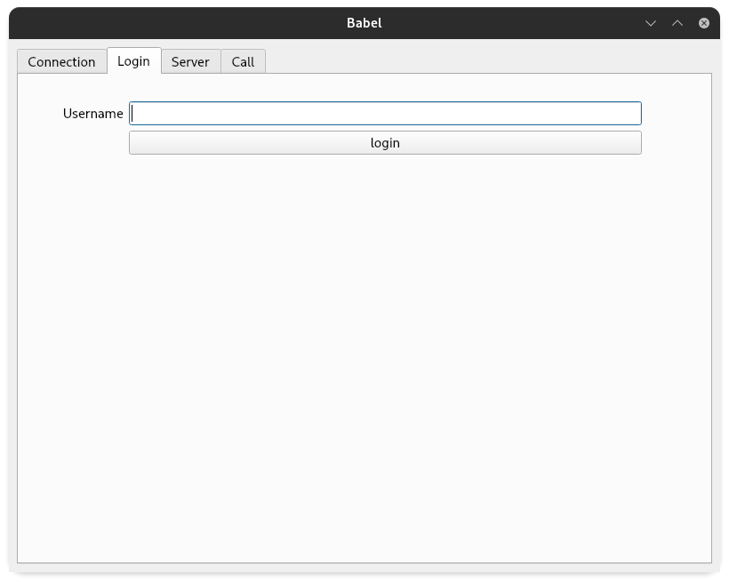
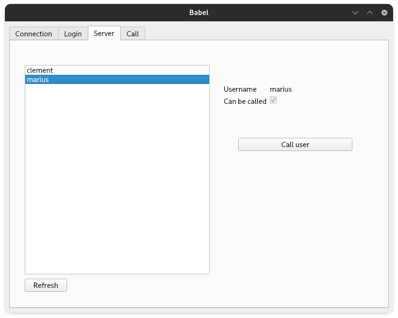
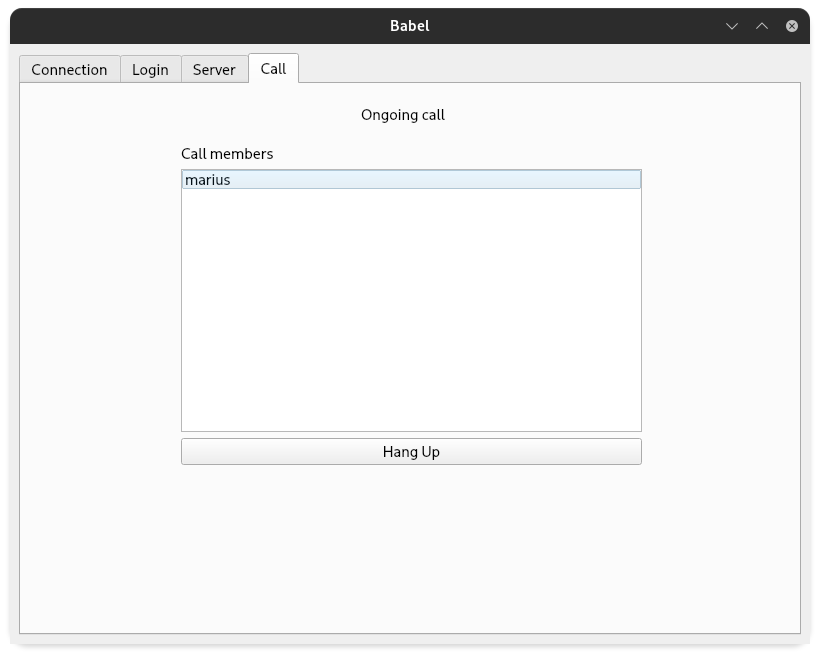

# Babel User Documentation!

# Introduction

Hi dear reader.

The Babel is a project aiming to create a VoIP application. VoIP stands for Voice over Internet Protocol.

You may already know some applications that use this technique (Discord, Skype, or TeamSpeak to name a few).

The Babel consists of a client and a server, clients connect to the server to find other clients and start a call. Calls are made between clients following a Peer-to-Peer architecture.

# Getting Started

## Installation

###  Build from sources

Sources are hosted on GitHub
You can clone the repository with the following command

    git clone https://github.com/Octopus773/Babel.git

The project is using [conan](https://conan.io/) to handle it's dependancies
You may have  to create a profile and add remotes to conan if it's your first time with it

Projects conan needed remotes:
- conancenter: https://center.conan.io
- bincrafters: https://bincrafters.jfrog.io/artifactory/api/conan/public-conan

  mkdir build
  cd build
  conan install .. --build missing

It may takes time for conan to download sources and build them

We're using [CMake](https://cmake.org/) to build the project
in the build folder:

	cmake ..
	cmake --build .
Binaries will be located in build/bin

# How to use

Here you go you got the Babel but how to use it ???

First, you got 2 programs :
- babel_client
- babel_server

To start the babel_server you need to use a CLI and give the port as argument
Here I'm starting the server on the port 4245

	./bin/babel_server 4245

The client has a GUI, you can launch it like any other program

// TODO set client images

# Connection to server

In order to connect to a Babel server, you have to fill the address and port of the running server

If the connection is achieved you won't get any message, just go to the login tab

When the client can't connect to the server, you may see messages like this

# Login

Here you will be asked to give the username to represent you on the server,

Our server doesn't accept multiple connected users with the same username.

# Home Page

Here you can see all the connected users with their usernames

You can call a user by selecting its username and click on the call user button

# Call

All the current members of call 

You're now able to use all the features of our Babel. Congrats !
